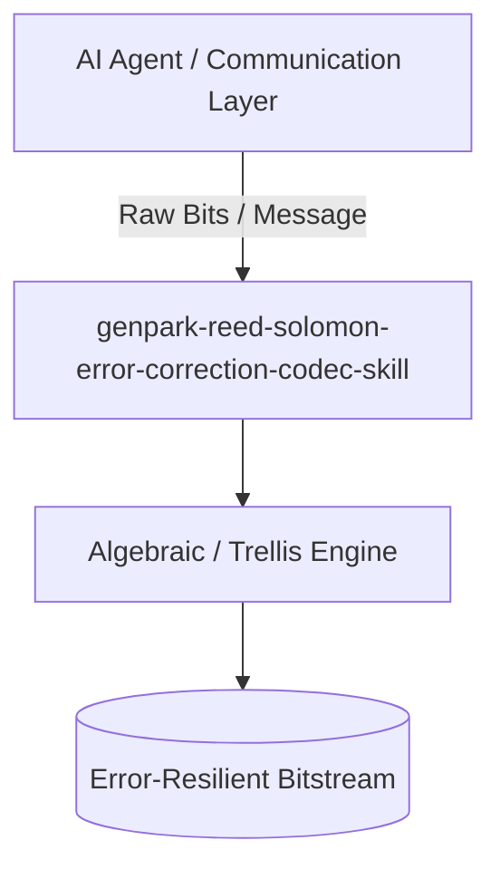

# genpark-reed-solomon-error-correction-codec-skill

[](https://github.com/alphaparkinc/genpark-reed-solomon-error-correction-codec-skill/actions)
[](https://opensource.org/licenses/MIT)
[](https://www.python.org/downloads/)

> Reed-Solomon (RS) error-correcting codec over Galois Field GF(2^8) generating parity syndromes, polynomial division, and multi-symbol error recovery.

## Architecture



## Features
- Pure standard library Python implementation with strictly zero pip dependencies.
- Production-grade information theory algorithms (Galois field arithmetic, Tanner graphs, Viterbi trellis).
- Native Model Context Protocol (MCP) server support for AI agent orchestration.

## Installation

```bash
git clone https://github.com/alphaparkinc/genpark-reed-solomon-error-correction-codec-skill.git
cd genpark-reed-solomon-error-correction-codec-skill
```

## Quickstart

```bash
python example_usage.py
```
